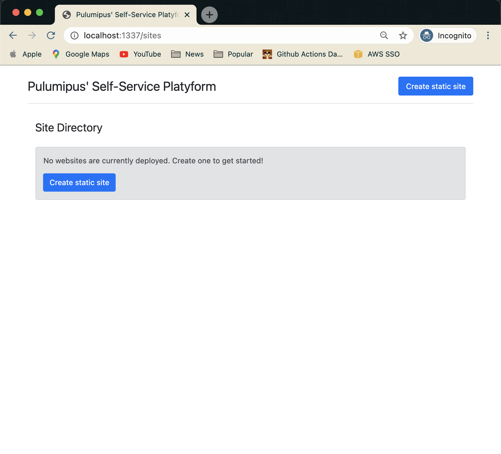

# Static Website Platyform

This application represents a starting point for how you might develop a self-service infrastructure platform on top of [Pulumi](https://pulumi.com)'s [Automation API](https://www.pulumi.com/blog/automation-api/).

In this case, we've used Python, [Flask](https://flask.palletsprojects.com/en/1.1.x/) and [Jinja](https://jinja.palletsprojects.com/en/2.11.x/) templates to create a website that allows users to deploy their own static websites, either by passing in a URL to an HTML file or by manually typing out the content. 

We've exposed all of the CRUD operations, so you can `update` and `delete` your websites as well.

This idea is just a starting point for how you might build out your own infrastructure platform. Static sites are just one option, but you could also provision databases or VMs (or any other cloud resources) using a similar self-service interface. Alternatively, you could build you could expose this functionality as a [REST API](https://github.com/pulumi/automation-api-examples/tree/main/python/pulumi_over_http), allowing deployments via CLI in addition to a web interface.

Pulumi's Automation API allows you to abstract away all of the "cloud stuff" that your users might not care to know, and bring them just the details they need, at the click of a button. The possibilities are endless!

**WARNING**: This is just a demo! I have not followed *any* security best-practices, so please don't deploy this thing to production.

## Instructions

To run this example you'll need a few pre-reqs:
1. A Pulumi CLI installation ([v2.10.1](https://www.pulumi.com/docs/get-started/install/versions/) or later)
2. The AWS CLI, with appropriate credentials.

First, set up your virtual environment:
1. ```shell
   $ python3 -m venv venv
   ```
2. ```shell
   $ venv/bin/python3 -m pip install --upgrade pip
   ```
3. ```shell
   $ venv/bin/pip install -r requirements.txt
   ```

In a terminal window, run the HTTP server that uses Automation API. It will also stream update logs:

```bash
$ FLASK_RUN_PORT=1337 FLASK_ENV=development venv/bin/flask run
* Environment: development
 * Debug mode: on
 * Running on http://127.0.0.1:1337/ (Press CTRL+C to quit)
 * Restarting with stat
 * Debugger is active!
 * Debugger PIN: 328-006-235
```

Then, in your browser, navigate to `localhost:1337/sites` and you should see a page matching the image below. Click around and start exploring!


